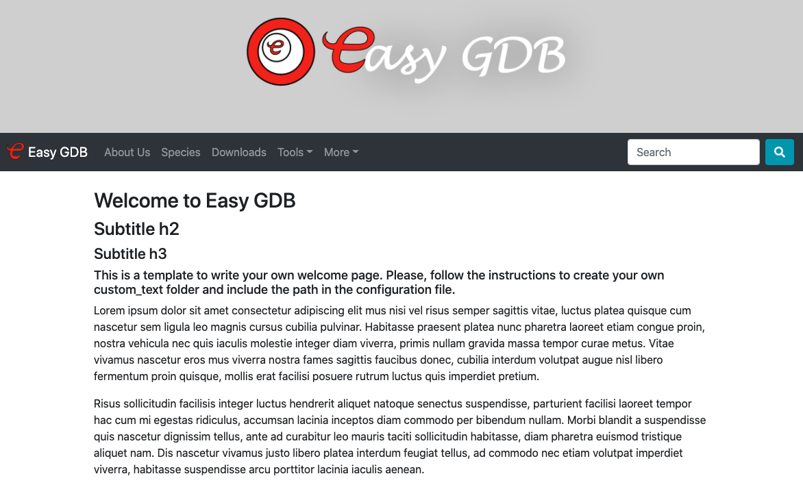

# EasyGDB

Welcome to EasyGDB. EasyGDB is a system designed to simplify the implementation of genomics portals and minimize their maintenance. EasyGDB genomics portals can include tools such as Expression atlas, BLAST, Genome browser (JBrowse), genetic variation explorer, file downloads, sequence extraction, annotation search, bulk annotation extraction, gene list lookup, and germplasm collection management. For more information check [this YouTube playlist](https://youtu.be/JTE-8zR5ogk)

Some examples of sites developed using EasyGDB are:

-   [MangoBase](https://mangobase.org/)
-   [OliveAtlas](https://www.oliveatlas.uma.es/)
-   [IHSM Subtropicals DB](https://ihsmsubtropicals.uma.es/)
-   [SkeletalAtlas](https://www.skeletalatlas.uma.es/)
-   [AvoBase](https://www.avocado.uma.es/)
-   [MAdLandExpr](https://peatmoss.plantcode.cup.uni-freiburg.de/easy_gdb/index.php)
-   [Ae. arabicum DB](https://plantcode.cup.uni-freiburg.de/aetar_db/index.php)

## Table of contents

-   [Installation](#installation)
    -   [Set up EasyGDB using the template example and Docker](#set-up-easy-gdb-using-the-template-example-and-docker)
        -   [Customize file paths](#customize-file-paths)
        -   [Customize your site](#customize-your-site)
            -   [Customize application name and header image](#customize-application-name-and-header-image)
            -   [Customize logos](#customize-logos)
            -   [Customize the toolbar](#customize-the-toolbar)
            -   [Home page](#home-page)
            -   [About Us](#about-us)
            -   [Species](#species)
            -   [Downloads](#downloads)
            -   [Tools](#tools)
            -   [Search](#search)
            -   [BLAST](#blast)
            -   [Sequence extraction](#sequence-extraction)
            -   [Genome browser](#genome-browser)
            -   [Annotation extraction](#annotation-extraction)
            -   [Gene expression](#gene-expression)
            -   [Gene version lookup](#gene-version-lookup)
            -   [More custom pages](#more-custom-pages)
                -   [Tables](#tables)
        -   [Customize JBrowse](#customize-jbrowse)
        -   [Private application](#private-application)
        -   [Start local server](#start-local-server)
        -   [Set up EasyGDB database](#set-up-easygdb-database)
            -   [Set up password](#set-up-password)
            -   [Create a new database](#create-a-new-database)
            -   [Create a new role (DB user)](#create-a-new-role--db-user-)
            -   [Import annotation schema to database](#import-annotation-schema-to-database)
        -   [Import annotations](#import-annotations)
    -   [Installation in linux system without Docker](#installation-in-linux-system-without-docker)
        -   [Install Git, PHP, BLAST and useful tools](#install-git--php--blast-and-useful-tools)
        -   [Install Perl dependencies for JBrowse and importing scripts](#install-perl-dependencies-for-jbrowse-and-importing-scripts)
        -   [load local-lib in Perl5lib](#load-local-lib-in-perl5lib)
        -   [Install PostgreSQL](#install-postgresql)
        -   [Install easyGDB](#install-easygdb)
            -   [Set up password](#set-up-password-1)
        -   [Set up server](#set-up-server)

## Installation

Easy GDB requires PHP to run. You can use Docker (<https://docs.docker.com/get-docker/>) to install our EasyGDB container (recommended for MAC and Windows) or follow the steps at the bottom to install EasyGDB from scratch in a Linux system (<https://github.com/noefp/easy_gdb#instalation-in-linux-system-without-docker>).

It should be easy to install it in a linux computer (everything was tested on Ubuntu), such as the ones usually provided in servers to hosts genomics database applications.

In most of the servers is probable that some of the tools needed are already installed, and if you work often with linux you would probably have some of them already.

### Set up EasyGDB using the template example and Docker

Using the Docker, the first step will be cloning the docker-compose repository. Go to the path where you want to save your genomics database and clone the easyGDB_docker repository from GitHub:

    git clone https://github.com/noefp/easyGDB_docker.git

Go into the easyGDB_docker folder

    cd easyGDB_docker

Then, build the container (in the easyGDB_docker folder):

    docker-compose build

and start the container using `docker-compose` (in the easyGDB_docker folder) or use the Docker desktop application:

    docker-compose up

Using the Docker container we install easy GDB at `/var/www/html/` (`src/` in the Docker container). Open the easy_GDB Docker container terminal or the Docker desktop application (in the easyGDB_docker folder).

    docker-compose exec easy_gdb /bin/bash

Clone the easy_GBD code from Github:

    git clone https://github.com/noefp/easy_gdb.git

Now, we will create the configuration and example folder structure. Go to the install folder inside easy_gdb (`easy_gdb/install`):

    cd easy_gdb/install/

and run the `setup.sh` script:

    bash setup.sh

When running the easy GDB setup, installing JBrowse Perl pre-requisites might take some minutes. Please be patient.

When the setup finishes, this should create some folders, subfolders and files at the same level as easy_gdb. You can take a look using your file browser at `src` or in the terminal using the commands below.

    ls -lh /var/www/html

You should be able to see the folders `annotations`, `blast_dbs`, `downloads`, `easy_gdb`, `egdb_files`, `expression_data`, `jbrowse`, `lookup`, `passport`, `private_expression_data` and `vcf`. Inside these folders there are some example templates to help you customize your own genomic web portal.

At this moment all the features of easy_gdb should be already available.

In a web browser (Chrome, Firefox, etc) go to: `localhost:8000/easy_gdb/`

You should be able to see an example of easy_gdb running.



> In case of installing easy GDB in a Linux system, not using Docker, run the next command to start a local PHP server:
>
> example_db\$ php -S localhost:8000

## Customize file paths

By default all configuration files contain the default paths used in the Docker container and everything should work without changing any path. However, it is possible to customize the paths to have your own file organization system.

In the file `configuration_path.php` you could change the configuration path to `/abosolute_path_to/egdb_files/egdb_conf`. By default it is pointing to `/var/www/html/egdb_files/egdb_conf` where the files will be placed using the docker container and the standard location in a server.

In the file `egdb_files/egdb_conf/easyGDB_conf.php` is possible to set the root path where the `easy_db` folder is. In the Docker container and usually in a server it would be `/var/www/html`. Locally, for example, you could have them in `/home/your_user_name/Desktop/example_db`.

If you want to use different names for your folders remember to change the names in the file paths included in `configuration_path.php` and `egdb_files/egdb_conf/easyGDB_conf.php`. For example, for development you could copy the `egdb_files` and rename it to the name of your project, repeting this process as many times as projects you have. That way you could manage multiple sites or multiple versions. You could easily change between them just commenting the path to all paths but the active one in `configuration_path.php`.

    TIP: One way to manage multiple sites is to create a copy of the `egdb_files` folder with its content and adding it to the path in the configuration file, writing the new name in the value of the `$egdb_files_folder` variable. It is a good practice to create always a copy of the `egdb_files` folder to keep always a reference of the example configuration.

Example of the `configuration_path.php` file:

    <?php
      //$conf_path = "/var/www/html/project1/egdb_conf";
      //$conf_path = "/var/www/html/project2/egdb_conf";
      $conf_path = "/var/www/html/active_project/egdb_conf";
      //$conf_path = "/var/www/html/egdb_files/egdb_conf";
    ?>

Afer the changes, reload the web browser `localhost:8000/easy_gdb/index.php` and check if you can see the home page of EasyGDB.

## Customize your site

In the configuration file `egdb_files/egdb_conf/easyGDB_conf.php` together with other JSON files you can customize your site.

Below we will see how to customize each page of the genomic portal step by step.

### Customize application name and header image

In the configuration file `egdb_files/egdb_conf/easyGDB_conf.php` you can customize the header variables `$dbTitle`, `$header_img` and `$db_logo` to change the site title, header image and site logo. The images are stored at `egdb_files/egdb_images/`. Try to change them and reload the web browser `localhost:8000/easy_gdb/index.php` to see the changes.

### Customize footer logos

In `egdb_files/egdb_images/logos/` you can place logo images (institutions, funding agencies, etc.), and you can use the file `logos.json` to customize size and link. Logos are displayed in all pages at the footer.

### Customize the toolbar

Below, in the toolbar variables, you can customize wich links will be displayed in the toolbar, enabling and disabling the tools and sections available. A value `1` enable the link and `0` disable it. Choose the links you want to show or hide.

Additionally, you can enable the variable `$tb_custom` to add your own links to the tool bar just by editing the `custom_toolbar.php` file in the `egdb_custom_text` directory. If you need to customize your home link (the site name by default defined by the variable `$dbTitle`), you can set `$tb_rm_home` to 1, to remove the site title, so you can create your own in `custom_toolbar.php`.

Lets take a look to each one of the links below.

#### Home page

The home page is always available. In the `egdb_custom_text` folder, you should be able to see the example text for the welcome page. You can open the file `egdb_files/egdb_custom_text/welcome_text.php` in a text editor to customize the content. It is possible to write code in PHP or just HTML (do not change the extension of the file). There, you could include CSS and JS. EasyGDB uses Bootstrap 4 for the style and some elements. You could find examples to create you own elements at <https://www.w3schools.com/bootstrap4/default.asp>

#### About Us

If the variable `$tb_about` is equal `1` in the configuration file (`easyGDB_conf.php`), then you should be able to see the example text for the `About Us` section.

You can open the file `egdb_files/egdb_custom_text/about.php` in a text editor to customize the content. Additionally, you can set the about variables `$ab_citation` to `0` or `1` to display, or not, the citation of the papers where the genomics portal or data were published. You can add the citation in `ab_citation.php`.

You can also add here information about the participant labs. For this, the `$ab_labs` should be enabled (equal to `1`) in `egdb_files/egdb_conf/easyGDB_conf.php`.

You can create a json file for each lab or you can copy and modify the provided examples to add your own information. There, you can include the lab name and, for each person, you can include name, position, a picture (placed in `egdb_files/egdb_images/people/`), link to a personal page, and, in the more_info array you could add data such as phone, email, and any other custom information.

Every time you change and save the `about.php` file, reload the page `localhost:8000/easy_gdb/about.php` to see the modifications.

#### Species

If you want to host data for multiple species or accessions you should enable the variable `$tb_species = 1`. If not you can disable it by setting it to `$tb_species = 0`.

Then, you will be able to see them at `localhost:8000/easy_gdb/species.php`

To customize the list of species, use the file `egdb_species/species_list.json`. There you can include species name, common name, image and link to a descriptive custom PHP file (`human.php`, `species1.php` and `species2.php`) where you can write all the information about the species. Create as many PHP species files as you need, customize the content and add them in the `egdb_species/species_list.json` file. Images for species menu are placed in `egdb_files/egdb_images/species/` It is recommendable to use the template as an example to avoid errors.

#### Downloads

You can use the `downloads` folder to place the files you want to provide for downloading. The content of that folder will be read and presented in the web site, replicating the folder, subfolder and file structure. It is recommended to compress the files before place them there for sharing.

You will be able to see this section at `localhost:8000/easy_gdb/downloads.php` or following the link `downloads` in the toolbar.

You can create your own structure of files and folders and place them in the downloads folder.

It is also compatible with H5AI (https://github.com/lrsjng/h5ai), which could be linked to `/downloads/` 

by placing the folder _h5ai inside `downloads`

and adding the next line to the enabled site in Apache:

    DirectoryIndex  index.html  index.php  /_h5ai/public/index.php

### Annotation File Database

Some tools such as *Search*, *Annotation Extraction*, and the *Gene Expression Atlas*, will require acces to the gene annotations.

To set up the functional annotation file database you just need to place a tab-delimited file (.txt) with the annotations of the genes in the folder `annotations` in src (`/var/www/html`).

You can place multiple annotation files or multiple subfolders with their respective annotation files inside.

The annotation file should include the gene names in the first column and the annotation IDs and descriptions in the next columns.

The header should include the name of the databases (Araport11, SwissProt, InterPro) as it is written in the `egdb_files/annotations/annotation_links.json` file, where the links to these databases are included. That way the database identifiers could be automatically linked to their databases.


| Gene | Araport11 | Araport11 Description | SwissProt | SwissProt Description | InterPro | InterPro Description |
| --- | --- | --- | --- | --- | --- | --- |
| gene1.1 | AT3G19210.3 | DNA repair/recombination protein | Q0PCS3 | Protein CHROMATIN REMODELING 25 (AtCHR25) | IPR014001;IPR000330;IPR001650 | Helicase superfamily;SNF2, N-terminal;Helicase, C-terminal |


It is important to include the word "Description" in the columns of the header including functional description.

The annotations including more than one ID should be separated by ";", as shown in the InterPro example.

You can add custom annotation links in the annotation_links.json file: `egdb_files/annotations/annotation_links.json`

```
{
  "TAIR10":"http://www.arabidopsis.org/servlets/TairObject?type=locus&name=query_id",
  "Araport11":"http://www.arabidopsis.org/servlets/TairObject?type=locus&name=query_id",
  "SwissProt":"http://www.uniprot.org/uniprot/query_id",
  "InterPro":"https://www.ebi.ac.uk/interpro/entry/InterPro/query_id",
  "NCBI":"https://www.ncbi.nlm.nih.gov/protein/query_id"
}
```


### Tools

It is possible to enable or disable the dropdown menu `Tool` by switching the variable `$tb_tools` to 1 or 0. Additionally the tools in this menu: `$tb_search` (Search), `$tb_blast` (BLAST), `$tb_jbrowse` (Genome browser), `$tb_seq_ext` (Sequence extraction), `$tb_annot_ext` (Annotation extraction), `$tb_lookup` (Gene version lookup) and `$tb_enrichment` (Gene set enrichment). Turn the variables to `1` or to `0` to enable or disable them.

`$tb_search_box` to enable the Search box in the toolbar is only available when the relational database is enabled (to be implemented soon for file annotations).

#### Search

To enable the search tool first we must setup the annotation file database. Then it will work automatically.

#### Annotation extraction

To enable the annotation extraction first we must setup the annotation files database. Then it will work automatically.

#### Genome browser

As we ran the setup file after cloning easy GDB, at this point, and example of JBrowse should be ready. You should be able to check it following the `Tools/Genome Browser` link in the menu bar, or at <http://localhost:8000/jbrowse/>.

For more information about how to add a new species and to add tracks see `Install and set up JBrowse` [below](#customize-jbrowse).

#### BLAST

In the web browser, follow the link to `BLAST` in the tools toolbar menu. There you will see the BLAST input page (http://localhost:8000/easy_gdb/tools/blast/blast_input.php). In `egdb_files/egdb_conf/easyGDB_conf.php`, you can change the input example sequence changing the variable `$blast_example`.

To add BLAST datasets we need to copy the blast databases in the `blast_dbs` folder (path can be changed in `easyGDB_conf.php`). The BLAST databases should be copied inside a category folder, such as `category_1` and `category_2` in the example template. If all the BLAST databases are included in a single category folder, there will be only a dropdown menu to select the BLAST database in the select Dataset section in the BLAST input page. If the BLAST databases are organized in two or more category folders, there will be an extra dropdown menu to select the category and then it will be posible to select the databases within the category.

    blast_dbs/
    |---- species_1/
          |---- proteins.fasta.psq
          |---- proteins.fasta.psi
          |---- proteins.fasta.psd
          |---- proteins.fasta.pog
          |---- proteins.fasta.pin
          |---- proteins.fasta.phr
          |---- nucleotides.fasta.nsq
          |---- nucleotides.fasta.nsi
          |---- nucleotides.fasta.nsd
          |---- nucleotides.fasta.nog
          |---- nucleotides.fasta.nin
          |---- nucleotides.fasta.nhr
    |---- species_2/
          |---- proteins.fasta.psq
          |---- proteins.fasta.psi
          |---- proteins.fasta.psd
          |---- proteins.fasta.pog
          |---- proteins.fasta.pin
          |---- proteins.fasta.phr

BLAST database files and category folders MUST NOT include spaces in their names. Underscores can be used in the file and folder names and they will be displayed as spaces in the web.

The template example include the folders `category_1` and `category_2`, but any other name can be used to name the category folders (without spaces or special characters). For example, we could create folders to organize BLAST databases for several species such as `Danio_rerio`, `Mola_mola`, `Salmo_salar`, etc.

You can use the next command lines to create your own blast databases from fasta sequence files:

For protein sequences:

    makeblastdb -in your_protein_sequence_file.fasta -dbtype 'prot' -parse_seqids

For nucleotide sequences:

    makeblastdb -in your_nucleotide_sequence_file.fasta -dbtype 'nucl' -parse_seqids

It is important to use the option `-parse_seqids` to create the indexes needed to extract sequences, which will be used by the gene views and the `Sequence extraction` tool.

The variable `$max_blast_input` (in `egdb_files/egdb_conf/easyGDB_conf.php`) controls the maximum number of sequences allowed as input in `BLAST`.

You can also add custom links for the BLAST output by customizing the blast_links.json file in the `blast_dbs` folder:

``` json
{
  "sample_blast_DB_proteins.fasta":"/easy_gdb/gene.php?name={subject}&annot=annotations.txt",
  "sample_blast_DB_genome.fasta":"/jbrowse/?data=data%2Feasy_gdb_sample&loc={chr}%3A{start}..{end}",
  "sample_blast_DB_nucleotides.fasta":"#",
  "sample_uniprot.fasta":"https://www.uniprot.org/uniprot/{subject}"
}
```

Just include the name of your database on the left (`sample_blast_DB_proteins.fasta`) and the link on the right (`/easy_gdb/gene.php?name={subject}&annot=annotations.txt`). 

You can provide any other links and use the variables in the example (`{subject}`, `{chr}`, `{start}`, `{end}`) to add gene names or coordinates extracted from the BLAST results. In this file several link examples are shown:

-   Link to genome browser: the variables `{chr}`, `{start}`, `{end}` will be replaced by the ones found in the results. Very useful for genome sequence BLAST databases.
-   No link: using a value of `#` will produce self links. For example for genes not included in your easy GDB database.
-   Gene name external links: the variable `{subject}` will be replaced by the subject gene name. It can be use to link to external databases, such as UniProt in the example above.

In the case of the installation of EasyGDB using the PostgreSQL relational database, if the blast database name is not included in the JSON file, the BLAST output will link to the easy GDB gene page by default. 

#### Sequence extraction

This tool uses the datasets in the `blast_dbs` folder to extract the sequences from a list of genes.

If you have the folder `blast_dbs` and added the blast databases there (explained above), then the tool should be ready to use. You can modify the example input gene list changing the variable `$input_gene_list` in `easyGDB_conf.php`.

The variable `$max_extract_seq_input` (in `easyGDB_conf.php`) controls the maximum number of input gene names to extract.


#### Gene version lookup

It should work correctly if some lookup files are placed in the `lookup` folder. Remove the provided examples and create your own lookup files following the same format. This tool is useful to, for example, get or provide a list of identifiers of the closest model organism genes, different gene versions or orthologs in other species.

The variable `$max_lookup_input` (in `easyGDB_conf.php`) controls the maximum number of gene names allowed as input.

#### Gene Set Enrichment

Work in progress. Available soon.

### Gene expression atlas

Switching `$tb_gene_expr` to 1 (in `easyGDB_conf.php`) will enable the link to the gene expression atlas in the tools dropdown menu of the toolbar. The expression datasets should be placed in the `expression data` folder (by default defined as `$expression_path` = `"$root_path/expression_data"`;).

In the `expression_data` folder you can find two examples of tab-delimited files, with extension `.txt`, containing expression data, and a JSON file named `expression_info.json`. 
Place your expression data files in the `expression_data` folder, as tab delimited text files with normalized data for each replicates in the columns (header), and each gene in the rows (first column), as shown in the examples. All replicates should have the same name in the header to be group together (For example: leaf, leaf, leaf, root, root, root, heat, heat, heat, etc.).

#### expression_info.json

the JSON file `expression_info.json` includes the names of the experiment description files, a link to the gene annotation page (by default it will check in the local annotations, but it is possible to add external links or remove links), and names of images used for each sample in case of enabling the expression card visualization or the cartoons. Gene annotations links will appear in the gene names of the Average values table.

You can switch the variable `$expr_cards` to 1 in the `easyGDB_conf.php` file to enable the expression card visualization. In that case, you can add image files in the images path (`egdb_images/expr/`) and add the names of the sample with their corresponding image in the JSON file `expression_info.json`. It is important that the sample name in the JSON is identical to the sample name in the tab-delimited expression data file, and the image file name correspond with the name in the images path.

``` json
  {
    "Example1 - Plant_gene_expression (RPKM).txt":
      {"link":"/easy_gdb/gene.php?name=query_id",
        "description":"example1_description.php",
        "images":
          {
            "Leaf":"leaf.jpeg",
            "Fruit":"fruit.jpeg",
            "Root":"root.jpeg",
            "Peel":"peel.jpeg",
            "Seed":"seed.jpeg",
            "Germinating Seed":"germinating_seed.jpeg",
            "Darkness":"darkness.jpeg",
            "Drought":"drought.jpeg",
            "Heat":"heat.jpeg",
            "Cold":"cold.jpeg"
          }
      },
    "Example2 - Organism dataset name (Units).txt":
      {"link":"#",
        "description":"example2_description.php"
      }
  }
```

The variable `$expr_menu` can be enabled in the configuration file to activate a link to the datasets information, which will display the information from all the datasets based on the information in the JSON file.

Dataset description PHP files should be placed in `egdb_custom_text/custom_pages/expr_datasets/`. Expression images should be placed in `egdb_images/expr/`.

#### Cartoons

Work in progress. Available soon.

#### Expression comparator

Work in progress. Available soon.

### Passport and phenotype tools

Work in progress. Available soon.

### Gene variation tools

Work in progress. Available soon.

### More custom pages

Enabling the variable `$tb_more` in `egdb_files/egdb_conf/easyGDB_conf.php` we will see a new tab in the toolbar called More. There, you could add as many custom pages as you want. They are stored at `egdb_files/custom_text/custom_pages/`, and we included two examples called `genome.php` and `other page.php`. You just need to create your own PHP pages and place them there. The name shown in the toolbar will be taken from the file name, and the content will be automatically wrapped by the header and footer.

Here, for example you can include statistics of your genome assembly, news and events page or anything you like.

#### Tables

In the `custom_pages` directory we can find an example of a custom page to visualize tab delimited files as formatted tables. The file `table_menu.php` provides the code to list all the files in the folder `custom_pages/tables`, and the file `table_to_page.php` is a template to format the file passed in the URL using the variable `table_name`. The variable `link_field` passed in the URL defines which column contains an unique id that can be used to link to the page `row_data.php`, which is a template to show the data contained in the row of the table where the linked id belongs to.

### Customize JBrowse

An example of JBrowse is already implemented but when you want to include the genome browser for your species of interest you can find more information in the JBrowse manual (<http://gmod.org/wiki/JBrowse_Configuration_Guide#prepare-refseqs.pl>). Additionally, below you can find some suggestions.

Open a terminal using docker-compose or Docker desktop

    docker-compose exec easy_gdb /bin/bash

Upload your sequences to JBrowse. This is how the gene models were uploaded in the example:

    jbrowse$ bin/prepare-refseqs.pl --fasta ../easy_gdb/templates/jbrowse/genome.fasta --out data/easy_gdb_sample
    jbrowse$ bin/flatfile-to-json.pl -gff ../easy_gdb/templates/jbrowse/gene_models.gff --key "EasyGDB gene models" --trackLabel egdb_gene_models --trackType CanvasFeatures --type mRNA --out data/easy_gdb_sample
    jbrowse$ bin/generate-names.pl --tracks egdb_gene_models --out data/easy_gdb_sample/

When adding new tracks, edit the file `data/easy_gdb_sample/trackList.json` to customize them in JBrowse. Below there is an example of the gene model track with link to the database (`url`).

``` json
    {
       "category" : "02 Annotations",
       "compress" : 0,
       "key" : "EasyGDB gene models",
       "label" : "egdb_gene_models",
       "onClick" : {
          "action" : "newWindow",
          "label" : "Go to gene view",
          "url" : "/easy_gdb/gene.php?name={id}"
       },
       "storeClass" : "JBrowse/Store/SeqFeature/NCList",
       "style" : {
          "className" : "feature"
       },
       "trackType" : "CanvasFeatures",
       "type" : "CanvasFeatures",
       "urlTemplate" : "tracks/egdb_gene_models/{refseq}/trackData.json"
    }
```

To allow multiple genome browser species, accessions or versions we need to modify the file `data/easy_gdb_sample/tracks.conf` to include the folder name where the data are stored (remember the jbrowse folder name in import_genes.pl)

    [general]
    dataset_id = easy_gdb_sample

In the file `jbrowse/jbrowse.conf` we can include as many species as we want. It is possible also to include external links in the URL field. Here we use the easy GDB example and the volvox and yeast examples from JBrowse:

    [datasets.easyGDB]
    url  = ?data=data/easy_gdb_sample
    name = Easy GDB Example

    [datasets.volvox]
    url  = ?data=sample_data/json/volvox
    name = Volvox Example

    [datasets.yeast]
    url  = ?data=sample_data/json/yeast
    name = Yeast Example

### Private application

In the file easy_gdb_apache.conf we are overwriting the apache configuration insidie the Docker repository. There there is a block of code that is commented out. If you want to have a private genomics database you can enalbe that piece of code to make private everything in /var/www/html/.

        <Directory "/var/www/html">
            AuthType Basic
            AuthName "Restricted Content"
            AuthUserFile /etc/apache2/.htpasswd
            Require valid-user
        </Directory>

Create the first user to access private data (Create the passwdfile. If passwdfile already exists, it is rewritten and truncated.) htpasswd -c /etc/apache2/.htpasswd First_user

Add new user htpasswd /etc/apache2/.htpasswd another_user

### Start local server

In many cases, after applying some changes you will need to restart the server to make the changes effective. In a local installation you can stop the application and them start it again from the terminal using the next command:

``` bash
php -S localhost:8000
```

Or restarting the the docker-compose service when using the Docker container.

In a server:

``` bash
sudo service apache2 restart
```

### Set up easyGDB PostgreSQL database (optional, not recommended)

There is an option to set up gene annotations in a PostgreSQL relational database. Althought it is not needed in recent versions of EasyGDB and performance does not make a difference. This method is no longer maintained.

We need to set up the database so the easy GDB code is able to find it. Remember to change the password by the password you will use for web_usr [below](#create-a-new-role-db-user)

open the file `egdb_files/egdb_conf/database_access.php`.

And setup the database connection based on the user, password and database name you used. The host is `DB` for the Docker installation and `localhost` for linux installations in servers or personal computers:

``` php
function getConnectionString(){return "host=DB dbname=annot1 user=web_usr password=password";};
```

Or in the case you will not use the relational database (for gene annotations):

``` php
function getConnectionString(){return null;};
```

> If not using the Docker container the host for the postgreSQL database is usually `localhost`

#### Set up password

[in the Docker container you already have a postgres password defined]

Open a terminal using docker-compose, docker exec or Docker desktop

    docker-compose exec DB /bin/bash

enter the postgres console:

    psql -U postgres

or

    docker exec -ti DB psql -U postgres

You can use `\q` to exit the PostgreSQL console or exit to leave the Docker bash console.

To change the password for the postgres user:

``` sql
\password postgres
You will be asked to type your new password
\q
```

#### Create a new database

Here, we will create a new database `annot1`. Any time you want to create a new database to test some data or new versions, you can create a new one and point to it in the file `egdb_files/egdb_conf/database_access.php`.

Open a terminal using docker-compose, docker exec or Docker desktop if you need to and create a new database:

``` sql
CREATE DATABASE annot1;
\l
\q
```

#### Create a new role (DB user)

It is recommended to use a different user than postgres to access the database (it will have limited control). Here, we will create the user `web_usr`. Note that in this example the password you type will be visible in the terminal, and the history, so we will create a temporal password and then we will change it in the next step.

Open a terminal using docker-compose, docker exec or Docker desktop if you need to and create a new database:

``` sql
CREATE ROLE web_usr WITH LOGIN ENCRYPTED PASSWORD 'tmp_password' CREATEDB;
\password web_usr
type a new password
\q
```

#### Import annotation schema to database

Now we should have an empty database called `annot1` created. In this step we will create the database schema:

    docker exec -i DB psql --username postgres annot1 < src/easy_gdb/scripts/create_annot_schema2.sql

#### Import annotations

Here, we will learn how to import annotations to the database. First we will import all the gene names, for that we will need a file such as `easy_gdb/templates/anotations/gene_list.txt` with all the gene identifiers from our organism. It is recommended to use the transcript name (gene1.1).

We will import all the gene names using the script `import_genes.pl` and we will provide the gene list file, species name, gene annotation version, and folder name for JBrowse (remember this name to use it when you set up JBrowse). This way we can link the genes with the genome browser.

Open a terminal using docker-compose or Docker desktop

    docker-compose exec easy_gdb /bin/bash

use a Perl script to import the gene list:

    perl easy_gdb/scripts/import_genes.pl egdb_files/annotations/gene_list.txt "Homo sapiens" "1.0" "easy_gdb_sample"

It will ask for the host name (`DB`), DB name (`annot1`), and the postgres password.

Now we will add annotations to the genes using the script `import_annots_sch2.pl`. For that, we will need a file such as `annotation_example_SwissProt.txt`, where we have the first column with the gene name, the second column with the annotation term (ID for SwissProt, or a close related model species, GO term, InterProscan term, EC, KEGG, etc.), and a third column with the annotation description. As an example we will import annotations for SwissProt and TAIR10 (for model plant arabidopsis). The script needs the annotations file, name of the annotation (SwissProt, TAIR10, etc.), species name and annotation version.

Example for SwissProt annotations:

    perl easy_gdb/scripts/import_annots_sch2.pl egdb_files/annotations/annotation_example_SwissProt.txt SwissProt "Homo sapiens" "1.0"

Example for TAIR10 annotations:

    perl easy_gdb/scripts/import_annots_sch2.pl egdb_files/annotations/annotation_example_TAIR10.txt TAIR10 "Homo sapiens" "1.0"

You can add custom annotation links in the annotation_links.json file: `egdb_files/annotations/annotation_links.json`

``` json
{
  "TAIR10":"http://www.arabidopsis.org/servlets/TairObject?type=locus&name=query_id",
  "Araport11":"http://www.arabidopsis.org/servlets/TairObject?type=locus&name=query_id",
  "SwissProt":"http://www.uniprot.org/uniprot/query_id",
  "InterPro":"https://www.ebi.ac.uk/interpro/entry/InterPro/query_id",
  "NCBI":"https://www.ncbi.nlm.nih.gov/protein/query_id"
}
```

This file includes example links for TAIR10, Araport11, SwissProt, InterPro and NCBI. The name used (TAIR10, Araport11, SwissProt ...) should be used in the import_annots_sch2.pl script, as shown above. In the link, `query_id` will be replaced by the gene id or annotation term.

## Installation in linux system without Docker

### Install Git, PHP, BLAST and useful tools

Lets install git to download the easy GDB code, PHP to be able to run the web and some other useful tools.

``` bash
sudo apt-get update
sudo apt-get install gcc
sudo apt-get install libpq-dev
sudo apt-get install git
sudo apt-get install php
sudo apt-get install zlib1g-dev
sudo apt-get install libexpat1-dev
sudo apt-get install ncbi-blast+
sudo apt-get install vim
sudo apt-get install less
sudo apt-get install wget
sudo apt-get install zip
sudo apt-get install make
sudo apt-get install lsb-release
```

### Install Perl dependencies for JBrowse and importing scripts

    apt-get install cpanminus
    cpanm -L ~/local-lib/ DBI
    cpanm -L ~/local-lib/ Term::ReadKey
    cpanm -L ~/local-lib/ DBD::Pg
    cpanm -L ~/local-lib/ local::lib
    cpanm -L ~/local-lib/ PerlIO::gzip

### load local-lib in Perl5lib

    vim ~/.bashrc

Add the line below at the end of the file. Remember to change your user name.

    export PERL5LIB=/home/your_username/local-lib/lib/perl5:$PERL5LIB

Enable the changes in the opened terminal. source \~/.bashrc

### Install PostgreSQL

[Already installed in the Docker container] To install Postgres you can follow the instructions at: <https://www.postgresql.org/download/linux/ubuntu/>

The next commands worked well at the time this documentation was writen:

``` bash
sudo sh -c 'echo "deb http://apt.postgresql.org/pub/repos/apt $(lsb_release -cs)-pgdg main" > /etc/apt/sources.list.d/pgdg.list'
wget --quiet -O - https://www.postgresql.org/media/keys/ACCC4CF8.asc | sudo apt-key add -

sudo apt-get update
sudo apt-get -y install postgresql
sudo apt-get install php-pgsql
```

### Install easyGDB

Ideally in a server or Linux system you should clone easy GDB at /var/www/html

Alternatively, if you do not have permissions or prefer otherwise, you could create a folder to contain your genomic database, using the location and name you like. For example you could use `example_db`, and you could create the folder with next command:

    mkdir example_db

Enter into the folder:

    cd example_db

Then follow the steps as in [Set up easy GDB using the template example and Docker](#set-up-easy-gdb-using-the-template-example-and-docker), but directly in your terminal, not using any of the docker commands.

at /var/www/html or example_db:

clone the repository:

     git clone https://github.com/noefp/easy_gdb.git

go to the install folder:

    cd easy_gdb/install/

Run the setup script (in the install folder):

    bash setup.sh

Go back from the install folder to the example_db folder:

    cd ../../

To start the PHP server that run the service to show the web, you can run this command in the same location where you installed easy_gdb:

    php -S localhost:8000

In web browser (Chrome, Firefox, etc) go to: `localhost:8000/easy_gdb/`

Do not forget to change configuration path in the file `easy_gdb/configuration_path.php`. By default it is `/var/www/html`, for the Docker installation and for linux servers. If you used a different path, you should change the variable from `$conf_path = "/var/www/html/egdb_files/egdb_conf"` to your path, for example `$conf_path = "/home/user/example_db/egdb_files/egdb_conf"`.

Then open the file `easyGDB_conf.php` in the folder `egdb_files/egdb_conf/` and change the `$root_path` to the path where you installed the example_db, in the previous example `$root_path = "/home/user/example_db"`.

open the file `egdb_files/egdb_conf/database_access.php` and setup the database connection based on the user, password and database name you used. The host is `DB` for the Docker installation and `localhost` for linux installations in servers or personal computers:

``` php
function getConnectionString(){return "host=localhost dbname=annot1 user=web_usr password=password";};
```

Or in the case you will not use the relational database (for gene annotations):

``` php
function getConnectionString(){return null;};
```

#### Set up password

If we installed PostgreSQL from scratch we need to create a password for postgres (it would be like the database default/root user).

You can use `\q` to exit the PostgreSQL console.

Connect to the database the first time:

``` bash
sudo -u postgres psql postgres
```

Create a password for the postgres user:

``` sql
\du
\password postgres
You will be asked to type your new password
\q
```

    psql -U postgres -h localhost -W

In Postgres console

Here, we will create a new database `annot1`. Any time you want to create a new database to test some data or new versions, you can create a new one and point to it in the file `egdb_files/egdb_conf/database_access.php`.

    CREATE DATABASE annot1;


    CREATE ROLE web_usr WITH LOGIN ENCRYPTED PASSWORD 'tmp_password' CREATEDB;
    \password web_usr

    \q

Back in your bash terminal

In this step we will create the database schema:

    psql -U postgres -d annot1 -h localhost -a -f easy_gdb/scripts/create_annot_schema2.sql

Here, we will learn how to import annotations to the database. First we will import all the gene names, for that we will need a file such as `easy_gdb/templates/anotations/gene_list.txt` with all the gene identifiers from our organism. It is recommended to use the transcript name (gene1.1).

We will import all the gene names using the script `import_genes.pl` and we will provide the gene list file, species name, gene annotation version, and folder name for JBrowse (remember this name to use it when you set up JBrowse). This way we can link the genes with the genome browser.

in (/var/www/html):

    perl easy_gdb/scripts/import_genes.pl egdb_files/annotations/gene_list.txt "Homo sapiens" "1.0" "easy_gdb_sample"

    perl easy_gdb/scripts/import_annots_sch2.pl egdb_files/annotations/annotation_example_SwissProt.txt SwissProt "Homo sapiens" "1.0"

    perl easy_gdb/scripts/import_annots_sch2.pl egdb_files/annotations/annotation_example_TAIR10.txt TAIR10 "Homo sapiens" "1.0"

### Set up server

In a server (not mandatory for local instalations) you would need to use Apache or Nginx webservers to host your application in a server. For example, you could install apache:

``` bash
sudo apt-get install apache2

cd /etc/apache2/
sudo cp 000-default.conf easy_gdb.conf
sudo a2dissite 000-default.conf
sudo a2ensite easy_gdb.conf
systemctl reload apache2
```

For example, you can add the database directory as DocumentRoot to serve easy_gdb in your server (server_address/easy_gdb)

    DocumentRoot /var/www/html

or:

    DocumentRoot /home/user/example_db

Remember to change the paths in the configuration file.

In many cases, after applying some changes you will need to restart the server to make the changes effective:

``` bash
sudo service apache2 restart
```
